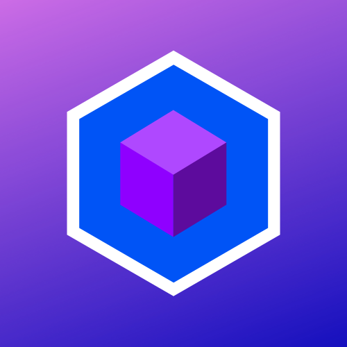

<a name="readme-top"></a>
[![Contributors][contributors-shield]][contributors-url]
[![Forks][forks-shield]][forks-url]
[![Stargazers][stars-shield]][stars-url]
[![Issues][issues-shield]][issues-url]
[![MIT License][license-shield]][license-url]

<!-- PROJECT LOGO -->
<br />
<div align="center">
  <a href="https://github.com/Lunari-Interactive/GD-Workshop-Demo">
    
  </a>

<h3 align="center">Game Development Workshop Demo</h3> 

  <p align="center">
     A Video Game Starter Template made in Unity.
    <br />
 <!--   <a href="https://github.com/Lunari-Interactive/GD-Workshop-Demo"><strong>Explore the docs »</strong></a> 
    <br /> -->
    <br />
    <a href="https://github.com/Lunari-Interactive/GD-Workshop-Demo">View Demo</a>
    ·
    <a href="https://github.com/Lunari-Interactive/GD-Workshop-Demo/issues/new?labels=bug&template=bug-report---.md">Report Bug</a>
    ·
    <a href="https://github.com/Lunari-Interactive/GD-Workshop-Demo/issues/new?labels=enhancement&template=feature-request---.md">Request Feature</a>
  </p>
</div>

<!-- TABLE OF CONTENTS -->
<details>
  <summary>Table of Contents</summary>
  <ol>
    <li>
      <a href="#about-the-project">About The Project</a>
      <ul>
        <li><a href="#built-with">Built With</a></li>
      </ul>
    </li>
    <li>
      <a href="#getting-started">Getting Started</a>
      <ul>
        <li><a href="#prerequisites">Prerequisites</a></li>
        <li><a href="#installation">Installation</a></li>
      </ul>
    </li>
    <li><a href="#license">License</a></li>
    <li><a href="#contact">Contact</a></li>
    <li><a href="#acknowledgments">Acknowledgments</a></li>
  </ol>
</details>


<!-- ABOUT THE PROJECT -->
## About The Project
A simple platformer made as a Starter Template for Video Game Development. Created to immerse students of Video Game Development in a workshop environment @Rizal Technological University

<!-- [![Product Name Screen Shot][product-screenshot]](https://example.com) -->

### Built With

* 
* 
* 


<!-- GETTING STARTED -->
## Getting Started

### Prerequisites
* [Unity Hub](https://unity.com/download#how-get-started)
* Unity Free Personal License
* [Unity Version 2021.3.14f1 LTS Release](https://unity.com/releases/editor/qa/lts-releases?version=2021.3&major_version=2021&minor_version=3&page=2#:~:text=December%201%2C%202022-,LTS%20Release,2021.3.14f1,-Released%3A%20November)
* [Visual Studio 2022 Unity Game Development Tools](https://visualstudio.microsoft.com/vs/unity-tools/)

### Installation

1. Clone the repo
   ```sh
   git clone https://github.com/Lunari-Interactive/GD-Workshop-Demo.git
   ```

<!-- LICENSE -->
## License

Distributed under the MIT License. See `LICENSE.txt` for more information.


<!-- CONTACT -->
## Contact
FrenzyyLumina - [@FrenzyyLumina](https://FrenzyyLumina) 
<br />
TatteredMayonez 


<!-- ACKNOWLEDGMENTS -->
## Acknowledgements

* []()

<p align="right">(<a href="#readme-top">back to top</a>)</p>


<!-- MARKDOWN LINKS & IMAGES -->
<!-- https://www.markdownguide.org/basic-syntax/#reference-style-links -->
[contributors-shield]: https://img.shields.io/github/contributors/Lunari-Interactive/GD-Workshop-Demo.svg?style=for-the-badge
[contributors-url]: https://github.com/Lunari-Interactive/GD-Workshop-Demo/graphs/contributors
[forks-shield]: https://img.shields.io/github/forks/Lunari-Interactive/GD-Workshop-Demo.svg?style=for-the-badge
[forks-url]: https://github.com/Lunari-Interactive/GD-Workshop-Demo/network/members
[stars-shield]: https://img.shields.io/github/stars/Lunari-Interactive/GD-Workshop-Demo.svg?style=for-the-badge
[stars-url]: https://github.com/Lunari-Interactive/GD-Workshop-Demo/stargazers
[issues-shield]: https://img.shields.io/github/issues/Lunari-Interactive/GD-Workshop-Demo.svg?style=for-the-badge
[issues-url]: https://github.com/Lunari-Interactive/GD-Workshop-Demo/issues
[license-shield]: https://img.shields.io/github/license/Lunari-Interactive/GD-Workshop-Demo.svg?style=for-the-badge
[license-url]: https://github.com/Lunari-Interactive/GD-Workshop-Demo/blob/main/LICENSE.txt
[product-screenshot]: Images/LunariInteractive.png
